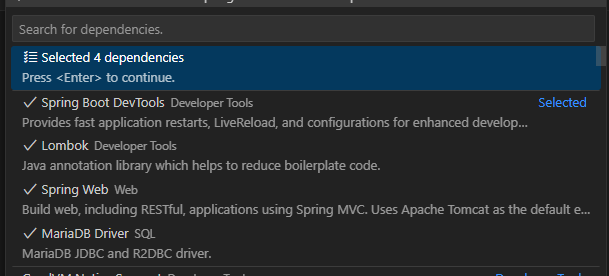

### 0. extension
#### lombok
#### java
#### gradle
#### spring initializr
#### 추가) gradle mybatis추가

### 1. xml 테스트

<ul>
    <li>mapper 생성</li>
    <li>controller 생성</li>
    <li>service 생성</li>
    <li>dto 생성</li>
</ul>

### 2. 테이블 생성

 
    CREATE TABLE dummy2 (
        dummy_id INT NOT NULL AUTO_INCREMENT PRIMARY KEY,
        dummy_name VARCHAR(100) NULL
    );

